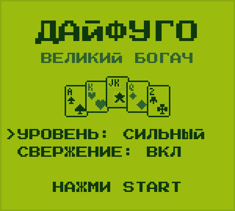
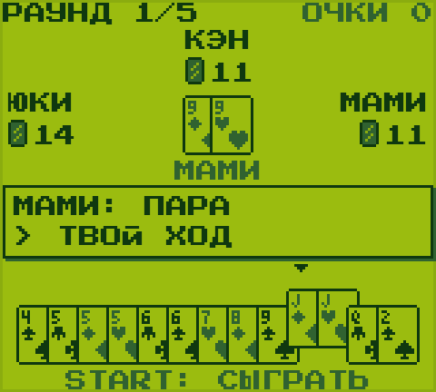
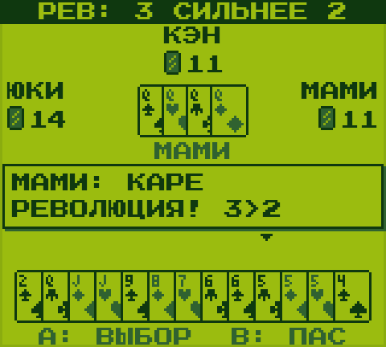
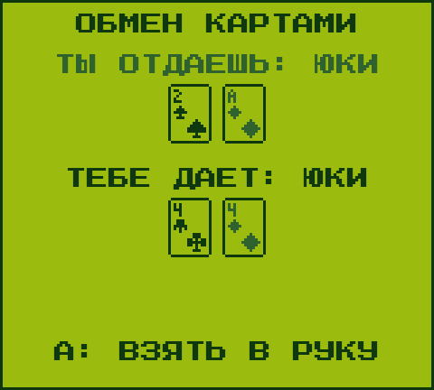

# Карманный Дайфуго

Японская карточная игра «Дайфуго» («Великий богач», она же «Президент») в стиле карманной консоли начала 90-х: зелёный экран в четыре оттенка, пиксельные карты, 8-битный звук.

Ностальгия по детству: в эту игру я играл на геймбое (в сборнике Trump Boy), а ещё мы играли в неё обычными картами во дворе.

### ▶ [Играть в браузере](https://alekseybaranyuk.github.io/daifugo/)

Работает на компьютере и на телефоне. На айфоне откройте ссылку в Safari и добавьте её на экран «Домой» через «Поделиться»: игра будет запускаться как отдельное приложение.

  
  

  
  

## Управление

| Кнопка | Клавиатура | Что делает |
|---|---|---|
| ← → | стрелки | выбор карты в руке |
| A или ↑ | Z, пробел | отметить карту (можно несколько одного достоинства) |
| B | X | снять отметку, а если ничего не отмечено, пас |
| START | Enter | сыграть отмеченные карты |
| SELECT | Shift | звук вкл/выкл |

На карты можно нажимать пальцем или мышью. В меню на титульном экране стрелками выбирается уровень соперников и правило свержения.

## Правила

**Цель раунда:** первым избавиться от всех карт. Играют четверо: вы и три компьютерных соперника, матч длится пять раундов.

**Сила карт** от слабой к сильной: `3 4 5 6 7 8 9 10 J Q K A 2 JK`

1. Первый ход делает игрок с тройкой бубен. Можно положить одну карту, пару, тройку или каре одного достоинства.
2. Следующие игроки кладут столько же карт, но сильнее, или пасуют. Когда все спасовали, стол очищается, и новый круг начинает тот, кто сыграл последним.
3. **Джокер** бьёт любую одиночную карту и заменяет любую карту в комбинации. Одиночного джокера бьёт только тройка пик.
4. **Восьмёрка** сразу очищает стол, и сыгравший ходит снова.
5. **Каре** устраивает **революцию**: порядок силы переворачивается, тройки становятся сильнее двоек. Следующее каре возвращает обычный порядок.
6. **Свержение** (можно выключить): если действующий дайфуго не вышел первым, он сразу получает последнее место.
7. **Обмен картами** со второго раунда: последнее место отдаёт первому две лучшие карты, третье место отдаёт второму одну, а те возвращают любые карты на свой выбор.

## Звания и очки

| Место | Звание | Очки |
|---|---|---|
| 1 | Дайфуго, великий богач | 3 |
| 2 | Фуго, богач | 2 |
| 3 | Хинмин, бедняк | 1 |
| 4 | Дайхинмин, нищий | 0 |

## Соперники

- **Лёгкий** играет жадно: кладёт самые слабые подходящие карты.
- **Средний** считает вышедшие карты, планирует руку на несколько ходов, бережёт джокера и двойки и мешает тому, кто вот-вот выйдет.
- **Сильный** вдобавок перед каждым ходом разыгрывает десятки случайных раздач скрытых карт до конца раунда и выбирает ход с лучшим средним результатом.

В тестовых прогонах сильный соперник против трёх средних выигрывал матч примерно в 46% случаев (при равных силах было бы 25%).

## Как устроено

Вся игра лежит в одном файле [`index.html`](index.html): HTML, CSS и JavaScript без библиотек и сборки. Карты рисуются попиксельно на Canvas, звук генерируется через Web Audio API. Из внешних ресурсов подключаются только шрифты Google Fonts (Press Start 2P и Golos Text).

Чтобы запустить локально, скачайте `index.html` и откройте его в браузере.
